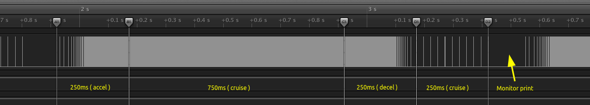

# iot-stepper-motor

<!-- TOC -->
- [iot-stepper-motor](#iot-stepper-motor)
  * [Description](#description)
  * [Quickstart](#quickstart)
  * [Analysis](#analysis)
    + [Motion equations](#motion-equations)
    + [Plot analysis (oxyplot)](#plot-analysis-oxyplot)
  * [Example01](#example01)
    + [logic analyzer](#logic-analyzer)
    + [video](#video)
    + [code](#code)
    + [plot (xlsx)](#plot-xlsx)
    + [monitor](#monitor)
  * [Examples wirings](#examples-wirings)
      - [nucleo-64 **stm32-f446re**](#nucleo-64-stm32-f446re)
      - [nucleo-144 **stm32-f767zi**](#nucleo-144-stm32-f767zi)
  * [TODO](#todo)
  * [Debugging](#debugging)
  * [How this project was built](#how-this-project-was-built)
<!-- TOCEND -->

## Description

:warning: this is a work in progress

Library to control stepper motor scurve motion type for ststm32 platform, mbed os framework.

## Quickstart

Install using vscode command palette `PlatformIO: New Terminal` referring to [platformio registry](https://platformio.org/lib/show/11637/iot-stepper-motor) cli mode doc.

If got trouble during compile, remove `.pio/libdeps/nucleo_f446re/iot-stepper-motor/library.json`.

## Analysis

```sh
git submodule update --init --recursive
cd analysis
dotnet run
```

### Motion equations

For symbolic calculus [AngouriMath](https://github.com/asc-community/AngouriMath) library was used.

- vars ( code refs [a](https://github.com/devel0/iot-stepper-motor/blob/0a21b306125915c26b5c39f992fe5b0b4b8aa9dc/analysis/Program.cs#L152-L154) ; [aMax](https://github.com/devel0/iot-stepper-motor/blob/0a21b306125915c26b5c39f992fe5b0b4b8aa9dc/analysis/Program.cs#L170) ; [s](https://github.com/devel0/iot-stepper-motor/blob/0a21b306125915c26b5c39f992fe5b0b4b8aa9dc/analysis/Program.cs#L178) ; [s<sub>d</sub>](https://github.com/devel0/iot-stepper-motor/blob/0a21b306125915c26b5c39f992fe5b0b4b8aa9dc/analysis/Program.cs#L194) ; [x](https://github.com/devel0/iot-stepper-motor/blob/0a21b306125915c26b5c39f992fe5b0b4b8aa9dc/analysis/Program.cs#L186) ; [x<sub>d</sub>](https://github.com/devel0/iot-stepper-motor/blob/0a21b306125915c26b5c39f992fe5b0b4b8aa9dc/analysis/Program.cs#L202) )
    - **t** (time) ; **t<sub>0</sub>** (initial time) ; **t<sub>r</sub>** (time relative to t<sub>0</sub>)    
    - **a** (acceleration) ; **a<sub>max</sub>** (max accel when t=d/2)
    - **s** (speed) ; **s<sub>0</sub>** (initial speed) ; **s<sub>d</sub>** (speed at end of motion when t=d)
    - **x** (position) ; **x<sub>0</sub>** (initial position) ; **s<sub>d</sub>** (position at end of motion when t=d)

<!-- $$
\large
t_r = t - t_0
\quad
s_d = s(d)
$$ --> 

<div align="center"></div>

<!-- $$
\large
a(t_r)=\frac{s_{d}}{d}\cdot \left(1-\cos\left(\frac{t_r}{d}\cdot 2\cdot \pi\right)\right)
$$ --> 

<br/>
<div align="center"></div>

<!-- $$
\large
a_{max}=a\left(\frac{d}{2}\right)
\quad
d = \left\{ \frac{2\cdot s_{d}}{a_{max}} \right\}
$$ --> 

<br/>
<div align="center"></div>

<!-- $$
\large
s(t_r)=\frac{\frac{-1}{2}\cdot \sin\left(\frac{2\cdot \pi\cdot t_r}{d}\right)\cdot d\cdot s_{d}}{d\cdot \pi}+\frac{s_{d}\cdot t_r}{d}+s_{0}
$$ --> 

<br/>
<div align="center"></div>

<!-- $$
\large
x(t_r)=x_{0}+\frac{\frac{1}{4}\cdot \cos\left(\frac{2\cdot \pi\cdot t_r}{d}\right)\cdot {d}^{2}\cdot s_{d}}{d\cdot {\pi}^{2}}+\frac{\frac{1}{2}\cdot s_{d}\cdot {t_r}^{2}}{d}+s_{0}\cdot t_r-\frac{\frac{1}{4}\cdot d\cdot s_{d}}{{\pi}^{2}}
$$ --> 

<br/>
<div align="center"></div>

<!-- $$
\large
s(d)=\left\{ \frac{2\cdot \left(-d\cdot s_{0}-x_{0}+x_{d}\right)}{d} \right\}
$$ --> 

<br/>
<div align="center"></div>

<!-- $$
\large
x(d)=d\cdot \left(s_{0}+\frac{1}{2}\cdot s_{d}\right)+x_{0}
$$ --> 

<br/>
<div align="center"></div>

### Plot analysis (oxyplot)

Follow graph shows the example described in the [analysis](https://github.com/devel0/iot-stepper-motor/blob/665799d9573e7852d47b750c6ae1fa2c27a3a87b/analysis/Program.cs#L307)

```csharp
var motion1_d = TimeSpan.FromMilliseconds(5000);
var motion1_rev_sec = 1d;

var motion2_d = TimeSpan.FromMilliseconds(2150);                
var motion2_rev_sec = 0d;
```


## Example01

### logic analyzer



### video

[](https://youtu.be/dsn793ZnKGA)

### code

```cpp
// Example01
// - go to high speed 6rev/s in 0.25s
// - cruise speed for more 0.75s
// - go to low speed 0.1rev/s in 0.25s
// - cruise speed for more 0.25s

#include <mbed.h>

#include <number-utils.h>
#include <string-utils.h>
#include <timer-utils.h>
#include <slist.h>

#include <iot-scurve-stepper.h>

DigitalOut mPort(M1_PIN);

int main()
{
    printf("START\n");

    auto speed_change_time = 250ms;
    auto pulse_rev = 400;
    auto pulse_width = 5us;

    auto speed_up_time = 1000ms;
    auto speed_high_rps = 6.0;

    auto speed_down_time = 500ms;
    auto speed_low_rps = 0.1;

    //---

    Timer timer;

    SCurveStepper m(1, timer, mPort, pulse_rev, pulse_width);

    timer.start();

    auto t_start = timer.elapsed_time();

    auto motion_issued = false;
    auto stop_issued = false;

    while (true)
    {
        auto t_now = timer.elapsed_time();
        
        if (!motion_issued)
        {
            motion_issued = true;
            t_start = t_now;
            m.setSpeed(speed_high_rps, chrono_s(speed_change_time));
        }
        if (!stop_issued && t_now - t_start > speed_up_time)
        {
            stop_issued = true;
            m.setSpeed(speed_low_rps, chrono_s(speed_change_time));
        }
        if (t_now - t_start > speed_up_time + speed_down_time)
        {
            m.debugStats(true);
            
            motion_issued = stop_issued = false;
        }

        m.control();
    }
}
```

### plot (xlsx)

This [workbook](analysis/calc.xlsx) can be used to view accel,speed,pos graph from given input data ( s<sub>0</sub>, s<sub>d</sub>, d, x<sub>0</sub> ).

**accel**


**cruise**


**decel**


### monitor

C-S-p `PlatformIO: Serial Monitor` ( or directly C-A-s )

```
m[1] pulse(exe/exp/max): 305/305/305   period_min: 209.000 ms   fMax: 4.785 kHz   pos: 1.980e5 step (∆:1.752e3)
m[1] pulse(exe/exp/max): 305/305/305   period_min: 209.000 ms   fMax: 4.785 kHz   pos: 1.997e5 step (∆:1.752e3)
m[1] pulse(exe/exp/max): 305/305/305   period_min: 209.000 ms   fMax: 4.785 kHz   pos: 2.015e5 step (∆:1.752e3)
m[1] pulse(exe/exp/max): 305/305/305   period_min: 209.000 ms   fMax: 4.785 kHz   pos: 2.032e5 step (∆:1.752e3)
m[1] pulse(exe/exp/max): 305/305/305   period_min: 209.000 ms   fMax: 4.785 kHz   pos: 2.050e5 step (∆:1.751e3)
m[1] pulse(exe/exp/max): 305/305/305   period_min: 209.000 ms   fMax: 4.785 kHz   pos: 2.067e5 step (∆:1.752e3)
```

notes:
- pulse(exe/exp/max) related to last part of motion ( decel )
- period_min, fMax measure minimum period and max pulse freq experienced from program start
- pos is the absolute position ( steps ) while ∆ is the diff from previous ( note that there are some difference caused by the cruise phase where there aren't control over the expected pulses but regulated by a timer; here there are some improvements todo )

## Examples wirings

from [examples/example.h](examples/example.h)

#### nucleo-64 **stm32-f446re**
```
                      _____                                  _____
           (M1) PC10 | · · | PC11 (M3)             (M5) PC9 | · · | PC8 (M7)
           (M2) PC12 | · · | PD2  (M4)             (M6) PB8 | · · | PC6 (M8)
                 VDD | · · | E5V                   (M9) PB9 | · · | PC5 (M10)
               BOOT0 | · · | GND                       AVDD | · · | U5V
                  NC | · · | NC                         GND | · · | NC
                  NC | · · | IOREF                "led" PA5 | · · | PA12
                PA13 | · · | RESET                      PA6 | · · | PA11
                PA14 | · · | +3V3                       PA7 | · · | PB12
                PA15 | · · | +5V                        PB6 | · · | NC
                 GND | · · | GND                        PC7 | · · | GND
                 PB7 | · · | GND                        PA9 | · · | PB2
                PC13 | · · | VIN                        PA8 | · · | PB1
                PC14 | · · | NC                        PB10 | · · | PB15
                PC15 | · · | PA0                        PB4 | · · | PB14
                 PH0 | · · | PA1                        PB5 | · · | PB13
                 PH1 | · · | PA4                        PB3 | · · | AGND
                VBAT | · · | PB0                       PA10 | · · | PC4
                 PC2 | · · | PC1                        PA2 | · · | NC
                 PC3 | · · | PC0                        PA3 | · · | NC
                      ￣CN7                                  ￣CN10
```

#### nucleo-144 **stm32-f767zi**

```
                                                   _CN7_
                                              PC6 | · · | PB8
                                             PB15 | · · | PB9
                                             PB13 | · · | AVDD
                  _CN8_                      PB12 | · · | GND
              NC | · · | PC8                 PA15 | · · | PA5
           IOREF | · · | PC9                  PC7 | · · | PA6
           RESET | · · | PC10                 PB5 | · · | PA7
           +3.3V | · · | PC11                 PB3 | · · | PD14
             +5V | · · | PC12                 PA4 | · · | PD15
             GND | · · | PD2                  PB4 | · · | PF12
             GND | · · | PG2                       ￣￣￣
             VIN | · · | PG3                                 
                  ￣￣￣                            _CN10
                                             AVDD | · · | PF13
                  _CN9_                      AGND | · · | PE9
             PA3 | · · | PD7                  GND | · · | PE11
             PC0 | · · | PD6                  PB1 | · · | PF14
             PC3 | · · | PD5                  PC2 | · · | PE13
             PF3 | · · | PD4                  PF4 | · · | PF15
             PF5 | · · | PD3                  PB6 | · · | PG14
            PF10 | · · | GND                  PB2 | · · | PG9
              NC | · · | PE2                  GND | · · | PE8
             PA7 | · · | PE4                 PD13 | · · | PE7
             PF2 | · · | PE5                 PD12 | · · | GND
        (M1) PF1 | · · | PE6 (M6)            PD11 | · · | PE10
        (M2) PF0 | · · | PE3 (M7)             PE2 | · · | PE12
             GND | · · | PF8 (M8)             GND | · · | PE14
        (M3) PD0 | · · | PF7 (M9)             PA0 | · · | PE15
        (M4) PD1 | · · | PF9 (M10)            PB0 | · · | PB10
        (M5) PG0 | · · | PG1                  PE0 | · · | PB11
                  ￣￣￣                           ￣￣￣￣
```

## TODO

- move by position
- control direction

## Debugging

- set example to start in [examples/example.h](src/examples/example.h) by setting a [define](https://github.com/devel0/iot-stepper-motor/blob/0a21b306125915c26b5c39f992fe5b0b4b8aa9dc/examples/example01/example.h#L6)
- start debugging using C-S-p `PlatformIO: Start Debugging`
- to debug examples/example01.cpp (included through [src/debug-main.cpp](src/debug-main.cpp)) it may needed to select only 1 platform from `platformio.ini` so the launch.json will generate accordingly; todo that comment others platform, ie:

```
[env]
src_filter = +<*> -<.git/> -<.svn/> -<example/> -<examples/> -<test/> -<tests/>

; [platformio]
; default_envs = nucleo_f446re, nucleo_f767zi

[env:nucleo_f767zi]
platform = ststm32
board = nucleo_f767zi
framework = mbed
test_build_project_src = true
debug_build_flags = -O0 -g -ggdb

; [env:nucleo_f446re]
; platform = ststm32
; board = nucleo_f446re
; framework = mbed
; test_build_project_src = true
; debug_build_flags = -O0 -g -ggdb
```

- [other references/troubleshoot](https://github.com/devel0/iot-stm32-ledblink-interrupt-debug#iot-stm32-ledblink-interrupt-debug)

## How this project was built

References:
- [Creating Library](https://docs.platformio.org/en/latest/librarymanager/creating.html?utm_medium=piohome&utm_source=platformio)
- [library.json](https://docs.platformio.org/en/latest/librarymanager/config.html)
